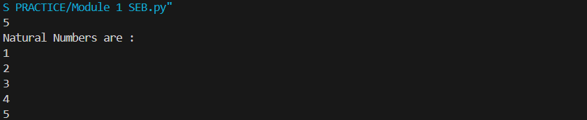
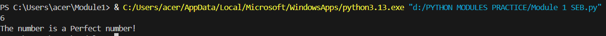
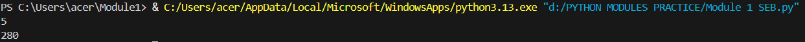
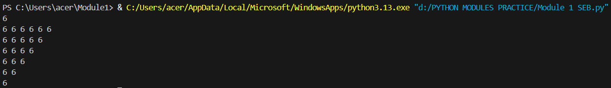
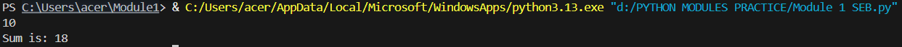

# EX NO 2(a)
## 🎯 Aim
To write a  python  program to print 1 to n natural numbers .

## 🧠 Algorithm
1. Get the n value using input() and convert it to an integer
2. using for loop print the natural numbers from 1 to n.

## 💻 Program
```
n=int(input())
print("Natural Numbers are :")
for i in range(1,n+1):
    print(i)
```

## Output



## Result
Thus a python program to print 1 to n natural numbers has been written and executed successfully.


# EX NO 2(b)
## 🎯 Aim
Python Program to check if a number is a Perfect number using the concept of functions.

## 🧠 Algorithm
1. Define a function named perfect
2. Get a integer as input using input()
3. Call the function using the number as input

## 💻 Program
```
def perfect(a):
    sum=0
    for i in range(1,a):
        if(a%i==0):
            sum+=i
    if(sum==a):
        print("The number is a Perfect number!")
    else:
        print("The number is not a Perfect number!")
a=int(input())
perfect(a)
```

## Output



## Result
Thus a python program to check if a number is perfect number or not has been written and executed successfully.


# EX NO 2(c)
## 🎯 Aim
To write a lambda function which takes z as a parameter and returns z*56 using python

## 🧠 Algorithm
1. Get an integer as an input.
2. Find the value of the given expression using lambda function

## 💻 Program
```
a=int(input())
lam=lambda z:z*56
print(lam(a))
```

## Output



## Result
Thus a python program to evaluvate an expression using lambda function has been written and executed successfully.


# EX NO 2(d)
## 🎯 Aim
To write a python program to print inverted pyramid pattern with the same digit

## 🧠 Algorithm
1. Get number of rows as input from the user.
2. Print the pattern using nested for loop.

## 💻 Program
```
n=int(input())
for i in range(n):
    for j in range(i,n):
        print(n,end=" ")
    print()
```

## Output



## Result
Thus a python program to print inverted pyramid pattern with the same digit has been written and executed successfully.

# EX NO 2(e)
## 🎯 Aim
To write a python program to print the sum of N  numbers which is divisible by 3.

## 🧠 Algorithm
1. Get n value as input from the user.
2. Using for loop iterate through numbers from 1 to n 
3. Find the sum of numbers that are divisible by 3

## 💻 Program
```
n=int(input())
sum=0
for i in range(1,n+1):
    if(i%3==0):
        sum+=i
print("Sum is:",sum)
```

## Output



## Result
Thus a python program to print the sum of n numbers which are divisible by 3 has been written and executed successfully.